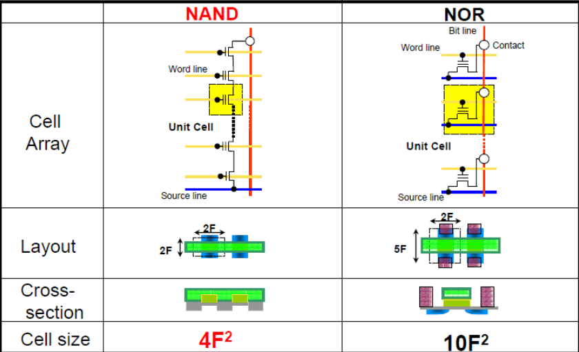

# NAND闪存

## NAND基本结构
### 闪存的基本结构介绍
**总体结构**：闪存的标准物理结构称为基本位（bit）。通常 MOS 的栅极（gate）和导电沟道层间由栅极绝缘层隔开，一般为氧化层（gate oxide）；而闪存在控制栅（control gate）与导电沟道间还多了一层物质，称之为浮栅（floating gate）。由于浮栅的存在，使闪存可以完成三种基本操作模式：即读，写，以及擦除。即便在没有电源供给的情况下，
浮栅的存在可以保持存储数据的完整性。

**写入和擦除**：由于浮栅的物理特性与结构，使其被注入负电子时，该位就由数字“1”被写成“0”，这一过程为写入，也可称为编程模式；相对的，当负电子从浮栅中移走后，该位就由数字“0”变成“1”，此过程称为擦除。关于电子注入或擦除的技术在业界有许多探讨。其中编程时采用隧穿注入法（channel hot injection）机理。当源极接地，控制栅的电压大于漏极区电压时，浮栅与导电沟道间氧化层的能带会变窄，因此在导电沟道中的负电子会被加速从沟道跃迁到浮栅中，进而完成编程（写入）的动作。在擦除信息时运用了 Rwler-Nordheim 隧穿效应，控制栅接地，擦除栅加正电压，电子由浮栅隧穿至擦除栅，完成对浮栅中电荷的擦除。

NAND闪存单元的物理结构以阵列→块→页的层次组织，一个NAND闪存阵列划分成很多个块而一个块又包含一定数目的页。一般情况下，同一个块内的闪存单元串包含到个闪存单元。

**页是闪存编程操作和读取操作的最小单位**，在目前实际设计闪存时，页的大小通常从字节到字节不等，对于闪存，擦除操作的最小单位则是整个块。

NAND闪存具有较快的抹写时间， 而且每个存储单元的面积也较小，这让NAND闪存相较于NOR 闪存具有较高的存储密度与较低的每位（bit）成本。同时它的可抹除次数也高出NOR 闪存十倍。然而NAND闪存的I/O接口并没有随机存取外部地址总线，它必须以区块性的方式进行读取，NAND闪存典型的区块大小是数百至数千位（bit）。

这是位线 （Bitline）方向的横截面图，每一个存储单元的浮栅顺序连接到字线（Wordline），通常情况下，64或128的存储单元串联连接在一起。许多NAND串通过选择栅极连接到一个共同的位线（Bitline）上。 

示例：16Gb 1Xnm的SLC颗粒内部架构 

这是一个2Gb 3Xnm的SLC颗粒内部架构。每个页(page)有33， 792个单元，每个单元代表1bit（SLC），所以每个页(page)就是4096Byte + 128Byte。 每个Block有64个页(page)组成，所以每个Block容量为262，144Byte + 8192Byte. 图中 4K字节用于存储数据，另外512字节用来做管理和ECC用。 

### NAND闪存存储单元介绍
NAND闪存的内部存储是金属-氧化层-半导体-场效晶体管（MOSFET），在氧化层内增加了浮栅（Floating Gate）结构，是真正存储数据的单元。浮栅不与任何连线相连，仅在绝缘的氧化层内孤立存在，类似一个孤岛。浮栅在氧化层内的位置，并不是处于中间，而是更靠近沟道一侧。浮栅的工作特性类似一个电子陷阱。器件在进行写入（编程）和擦除等操作时，电子将通过热载流子注入和FN遂穿的模式，在沟道和浮栅间移动。电子进入浮栅后，如果没有外部应力，电子将无法自行脱离浮栅，从而浮栅可以实现存储电荷的作用。通过判断浮栅上电荷的多少，可以判断存储器所存储的状态。NAND闪存存储器的基本存储单元是，单晶体管的复合栅结构，结构图如下：

## NAND闪存存储原理
### NAND存储原理介绍

NAND闪存将数据存储在由浮闸晶体管组成的记忆单元数组内。

NAND闪存的每个存储单元类似一个标准MOSFET， 除了晶体管有两个而非一个闸极。在顶部的是控制闸（Control Gate， CG），如同其他MOS晶体管。但是它下 方则是一个以氧化物层与周遭绝缘的浮闸（Floating Gate， FG）。这个FG放在CG与 MOSFET通道之间。由于这个FG在电气上是受绝缘层独立的， 所以进入的电子会被 困在里面。在一般的条件下电荷经过多年都不会逸散。当FG抓到电荷时，它部分屏 蔽掉来自CG的电场，并改变这个单元的阀电压（VT）。在读出期间。利用向CG的电 压，MOSFET通道会变的导电或保持绝缘。这视乎该单元的VT而定（而该单元的VT 受到FG上的电荷控制）。这股电流流过MOSFET通道，并以二进制码的方式读出、 再现存储的数据。在每单元存储1位（bit）以上的数据的MLC设备中，为了能够更精确的测定FG中的电荷位准，则是以**感应电流的量**而非单纯的有或无）达成的。 

**热电子注入**：

借由热电子注入写入一个NAND FLASH记忆单元（将其在逻辑上设为 0），对CG施加高电压（通常大于10V）。现在通道是开的，所以电子可以从源极流入 漏极，源-漏电流够高了，足以导致某些高能电子越过绝缘层，并进入绝缘层上的FG。

漏极与CG间有一个大的、相反的极性电压，借由量子穿隧效应可以将电子拉出FG，所以能够地用这个特性抹除NAND Flash单元（将其重设为“1”状态）。

虽然抹写都需要高电压才能进行，不过实际上现今所有NAND闪存芯片是借由芯 片内的电荷磅产生足够的电压，所以只需要一个单一的电压供应即可。

NAND Flash芯片别分为若干抹除片段，称为区扇，是抹除操作的最小单元，而写入的最小单元是字节。

### NAND存储单元读写擦操作

写入：控制Control Gate去充电（对Control  Gate加压20V），使得悬浮门存储的电荷够多，超过阈值Vth，就表示0。

擦除：对悬浮门加电20V，低于阈值 电压Vth，就表示1。 

读：给Control Gate加一定的电压，如果低于阈值电压Vth，通道没有电流导通，就表示0；如果高于阈值电压Vth，通道有电流导通，就表示1。 

