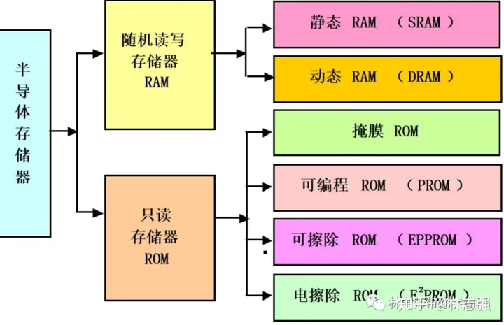
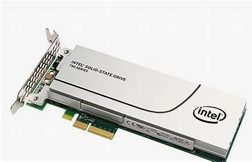

# 内存分类
计算机内存多种多样，是内置或外部连接到计算机设备或服务器的数据存储技术的总称。

内存可大体分为两类：主要内存和次要内存
## 主要内存
主内存访问速度更快，物理上靠近CPU，以尽可能减小通信时间。主要内存包括随机存取存储器（**RAM**）和只读存储器（**ROM**）。

RAM 和 ROM 都用来存储数据供 CPU 直接访问。RAM 是易失性的，这意味着一旦系统断电，其数据就会被删除。ROM 是非易失性的，这意味着它在系统断电后仍保留其数据。

### 随机存取存储器（RAM）
RAW的名称源自CPU访问它的方式，CPU 对其进行随机扫描以获取适当的信息，而不是遵循严格的指示。以均衡所有存储的数据位之间的访问时间。
#### 特征：1.速度快
RAM仅仅比CPU慢一点点，可以节省 CPU 每次需要数据或指令时到达辅助存储器的时间。
#### 特征：2.成本高

### 动态内存（DRAM）
最常见的 RAM 类型的每个单元中都包含一个晶体管和一个电容器。**所有计算机都必须包含 RAM 和 DRAM 才能有效运行**。最古老的 DRAM 版本被称为单数据速率 (SDR) DRAM，但 DDR2、DDR3、DDR4 和 DDR5 等较新的版本往往更加节能且生产力更高。不同类型的 DRAM 不兼容，计算机只能使用一种类型的 DRAM。
### 静态随机存储器（SRAM）
SRAM 比 RAM 或 DRAM 更快，但价格要贵得多。它也更庞大，每个单元中有六个晶体管。因此，SRAM 仅少量使用，并且几乎总是作为高速缓存来协调设备的主 RAM 和 CPU 之间的通信，并缩小时钟速度的差距。SRAM 最快且最小的实现方式是作为 CPU 核心内部的高速缓存，以相同的速度工作以消除延迟。
### 只读存储器（ROM）
ROM：存储在其中的数据不可变——无法使用普通的方式删除或更改。

当设备打开或启动时，CPU 首先读取的是 ROM 上的指令，其中通常包含「引导代码」，允许计算机执行在辅助存储器上启动操作系统的必要步骤。
#### 特征：速度快、非易失性

### 可编程只读存储器 (PROM)
PROM是在空状态下制造的，事后可以使用PROM编程器或刻录器对PROM编程

### 可擦除可编程ROM（EPROM）

EPROM上存储的信息可以擦除然后重新编程

### 电擦除可编程ROM（EEPROM）

EEPROM不需要取出来进行擦除和重新编程。

## 辅助内存
辅助内存是计算机内存中持久的、非易失性的部分，不由CPU直接访问。为更经济的方式长期存储大量数据而设计。

不同类型的辅助存储器使用户能够存储个人数据和信息以及可由计算机 CPU 通过 RAM 间接访问的软件、应用程序和服务。

### 硬盘驱动器（HDD）

硬盘驱动器有许多移动部件，所有这些部件都有自己可能的错误点。它们的噪音也很大，消耗大量电量，并且与平均 RAM 的速度相比，访问和写入速度可能更慢。

HDD适合长期存储和归档。

#### 便宜，耐用性差

### 固态硬盘（SSD）

固态硬盘是一种基于半导体的长期非易失性存储。在持久数据存储中使用 NAND 闪存，通常用作计算机中的辅助存储来保存个人文件。SSD 使用闪存将数据保存在集成电路中。SSD 上的数据可以以电子方式写入、读取、复制和传输，而不会产生噪音或需要移动。

SSD 能够**安静、高效**地运行，同时将物理损坏的可能性降至最低。虽然它们**不那么耐用**，但可以持续长达五年，这意味着它们对于档案和长期存储来说不那么有效。它们比 HDD 更快、更紧凑，但价格昂贵且容量往往更小。

### 光驱（CD或DVD）

光存储是使用激光从 CD、DVD 和蓝光光盘等光介质中存储和检索数据的存储的总称。大多数光存储光盘都是读/写的，允许反复擦除新信息并将新信息重新刻录到其表面，但需要专门的驱动器。

工作原理：发射低能激光束来扫描旋转的光存储介质的表面。写入和读取过程的速度取决于光盘的旋转速度。

### 磁带机

长期、持久、非易失性数据存储设备，使用磁带来存储、读取和写入数据位。需要专门的读取设备。

#### 成本低、易维护、寿命长、速度慢、体积大

### 存储阵列
存储阵列，也称为磁盘阵列，由一组快速旋转的 HDD、SSD 或这两种存储类型的混合组成，是服务器存储最常见的替代方案，因为阵列将多个驱动器组合成一个具有集中管理功能的单个大规模数据存储系统。

存储阵列适用于拥有大量数据的组织、企业和企业，这些数据需要集中管理，但需要由多个用户远程访问。

### 网络附加存储与云存储