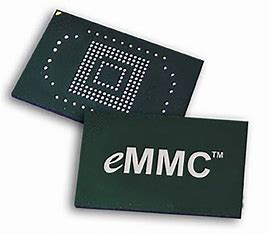

# 闪存的分类
**由闪存基本储存单元的连接方式不同而分类**

**总体特征**：
- 与EPROM相比较，Flash存储器具有明显的优势一一在系统电可擦除和可重复编程，而不需要特殊的高电压（某些第一代闪速存储器也要求高电压来完成擦除和/或编程操作)。
- 与EEPROM相比较，Flash存储器具有成本低、密度大的特点。其独特的性能使其广泛地运用于各个领域，包括嵌入式系统，如PC及外设、电信交换机、蜂窝电话、网络互联设备、仪器仪表和汽车器件，同时还包括新兴的语音、图像、数据存储类产品，如数字相机、数字录音机和个人数字助理(PDA)。
## 1.NAND FLASH

NAND Flash最大的特点在于把基本储存单元串联起来使用。

基本储存单元Cell 1的源极连接到基本储存单元Cell 2的漏极，基本储存单元Cell 2的源极连接到基本储存单元Cell 3的漏极，……依此类推，到最后，基本储存单元Cell n-1的源极连接到基本储存单元Cell n的漏极，基本储存单元Cell n的源极连接到地。这样，一连串的基本储存单元组成一条数据线（Data Line）。为了管理方便，在该数据线的前端，即Cell 1的漏极，加入一个开关管SW1。当向SW1的G极施加有效电平时，这条数据线才被选中。每个基本储存单元的G极，连接到各自对应的字线（Word Line）。

NAND Flash还可以细分为SLC、MLC、TLC、QLC、PLC等。

**SLC**:Single Level Cell

早期的NAND Flash，只需要判断悬浮闸中是否有电荷。假设有电荷为“1”，则无电荷就是“0”。一个基本储存单元只储存1bit数据。这种NAND Flash被称为SLC。它的读写操作简单快速。

SLC主要针对军工，企业级应用，有着高速写入（编程），低出错率，长耐久度特性。

**MLC**:Multiple Level Cell

后来发展出一种新的NAND Flash，通过内存储存的电压控制精准读写，一个基本储存单元内可以储存2bit数据。根据悬浮闸中电荷的多少（与四个参考电压比较）来判断数据。

由于读写过程都要进行电平比较，所以MLC的读写比SLC慢很多。

MLC主要针对消费级应用，有着4倍容量于SLC，低成本，适合USB闪盘，手机，数码相机等储存卡。如今也被用于消费级固态硬盘上。

MLC和SLC虽然使用相同的电压值，但是MLC电压之间的阈值电压被分成了4份，直接影响了MLC性能和稳定性。相邻的存储电荷的悬浮门间会互相干扰，造成悬浮门里的电荷不稳定出现位（bit）错误，MLC由于阈值电压相比SLC更接近，造成出错几率更大。

**TLC**：Triple Level Cell

TLC则是在一个基本储存单元内储存4bit数据。原理和MLC一样，只是多划分了几个等级。**更慢**

TLC之后，还发展出了*QLC*、*PLC*等，每个单元分别可以储存8bit和16bit数据。

## 2.NOR FLASH
NOR Flash的基本储存单元是并联连接。各基本储存单元的G极连接到字线（Word Line），源极连接到源线（Source Line），漏极连接到数据线（Data Line）。如下图所示。

在通信方式上Nor Flash 分为两种类型：CFI Flash和 SPI Flash。

**NAND Flash和NOR Flash的异同点**

1. **结构**：
    - NOR Flash更像内存，地址线和数据线是独立的。
    - NAND Flash：数据线和地址线公用，如下图。
    
1. **写入方式**：
    - NOR Flash写入时采用通道热电子（Channel Hot Electron）方式。在G极和漏极之间施加较高的电压，以提高通过N沟道的电子的能量，让这些电子可以突破绝缘层进入悬浮闸。因此，这种闪存的能耗较大，不适于低压操作。
    - NAND Flash写入时采用隧道（Tunel）方式。利用氧化膜的隧道现象来写入资料。因此能耗较小。
2. **读取速度**：
    - NOR Flash的读出速度非常快。读出时间只需要100ns。适用于随机存取。
    - NAND Flash是串联连接，所以它只适合顺序存取（Sequential Access）。如果要随机储存（Random Access），则速度非常的慢。
3. **存储密度**：
    - NOR Flash的基本储存单元体积较大，很难高密度集成。
    - 而NAND Flash基本储存单元体积较小，适于高密度集成。也因此，市面上容量较大的闪存，基本上是NAND Flash。
4. **接口差别**：
    - 1、NAND Flash使用复杂的I/O口来串行地址存取数据，8个引脚用来控制传送控制、地址和数据信息2、NAND读和写操作采用512字节的块，类似硬盘管理的操作，基于NAND的存储器可以取代硬盘或其他块设备。3、接口固定，升级简单。
    - 1、NOR Flash带有SRAM接口，有足够的地址引脚来寻址，可以很容易的存取内部的每一个字节2、升级麻烦，不同容量的NorFlash的地址线需求不一样，在更换不同容量的NorFlash芯片时不方便。
5. **坏块处理**：
    - NAND：**错误检查和纠正**，坏块随机分布的，当失效的比特很多且连续时，失效的比特所在的区域会被集体失效，失效的区域会被标记为不可用。
    - NOR：**冗余比特替换**，芯片设计时，每组存储单元会有若干个冗余比特，当该组存储单元存在失效的比特，就可以用冗余比特加以替换。当失效的比特很多且连续时，失效的比特所在的区域会被集体替换掉。
6. **擦除操作**：
    - NAND：非常简单。以8KB，32KB的块进行，执行操作最多只需要4ms，擦除单元更小，相应的擦除电路更少。同时可抹除次数高出NOR闪存十倍。
    - NOR：不能单字节擦除，必须以块为单位或对整片执行擦除操作。在对存储器进行重新编程之前需要对块或整片进行预编程和擦除操作，将目标块内所有的位都写为0。以64KB，128KB的块执行，执行一个写入/擦除操作的时间为5S。
7. **应用**：
    - NAND：功能相对简单，通常需要搭配相应的控制芯片和驱动程序，才能对其进行操作。
    - NOR：功能丰富，不需要其他的软件支持，就可以被系统直接寻址，并在内部直接运行操作代码。

错误检查和纠正：芯片中每组存储单元会有若干个比特用做数据的校验，当该组存储单元存在失效的比特，则通过相应的数据校验算法还原中真实的数据。

为了兼备NAND Flash的高密度集成和NOR Flash的快速随机存取，并避开它们的缺点，日本三菱和日立等公司又研发出了DINOR Flash和AND Flash。

## 3.DINOR FLASH
DINOR和NOR一样具有快速随机读取的功能，按字节随机编程的速度略低于NOR,而块擦除速度快于NOR。

DINOR Flash在编程和擦除操作时电荷移动方向与NOR Flash相反,在执行擦除操作时无须对页进行预编程，且编程操作所需电压低于擦除操作所需电压.

DINOR FLASH仍然不成熟。
## 4.AND FLASH

AND技术是Hitachi公司的专利技术。Hitachi和Mitsubishi共同支持AND技术的Flash Memory。AND技术与NAND一样采用“大多数完好的存储器”概念，目前，在数据和文档存储领域中是另一种占重要地位的闪速存储技术。

## 5.UltraNAND FLASH
AMD与Fujistu共同推出的UltraNAND技术，称之为先进的NAND闪速存储器技术。

与NAND标准兼容：拥有比NAND技术更高等级的可靠性；可用来存储代码，从而首次在代码存储的应用中体现出NAND技术的成本优势，它没有失效块，因此不用系统级的查错和校正功能，能更有效地利用存储器容量。

## 6.由EEPROM派生的Flash存储器
EPROM具有很高的灵活性，可以单字节读写（不需要擦除，可直接改写数据），但存储密度小，单位成本高。部分制造商生产出另一类以EEPROM做闪速存储阵列的Flash Memory,如ATMEL、SST的小扇区结构闪速存储器（Small Sector Flash Memory）和ATMEL的海量存储器（Data-Flash Memory）。

**特点**:

    - 1：读写的灵活性逊于EEPROM，不能直接改写数据。在编程之前需要先进行页擦除，但与NOR技术Flash Memory的块结构相比其页尺寸小，具有快速随机读取和快编程、快擦除的特点。
    - 2：与EEPROM比较，具有明显的成本优势。
    - 3：存储密度比EEPROM大，但比NOR技术Flash Memory小。

## 7.eMMC Flash

eMMC是embedded MultiMediaCard的简称，即嵌入式多媒体卡,是一种闪存卡的标准，它定义了基于嵌入式多媒体卡的存储系统的物理架构和访问接口及协议，具体由电子设备工程联合委员会JEDEC订立和发布。它是对MMC的一个拓展，具有体积小，功耗低，容量大等优点，非常适合用作智能手机、平板电脑、移动互联网设备等消费类电子设备的存储介质。

<figure class="half">
    
    
</figure>

## 发展趋势

存储器的发展都具有更大、更小、更低的趋势，这在闪速存储器行业表现得尤为淋漓尽致。随着半导体制造工艺的发展，主流闪速存储器厂家采用018μm，甚至0.15μm的制造工艺。借助于先进工艺的优势，Flash Memory的容量可以更大：NOR技术将出现256Mb的器件，NAND和AND技术已经有1Gb的器件；同时芯片的封装尺寸更小：从最初DIP封装，到PSOP、SSOP、TSOP封装，再到BGA封装，Flash Memory已经变得非常纤细小巧；先进的工艺技术也决定了存储器的低电压的特性，从最初12V的编程电压，一步步下降到5V、3.3V、27V、1.8V单电压供电。这符合国际上低功耗的潮流，更促进了便携式产品的发展。

　　另一方面，新技术、新工艺也推动Flash Memory的位成本大幅度下降：采用NOR技术的Intel公司的28F128J3价格为25美元，NAND技术和AND技术的Flash Memory将突破1MB 1美元的价位，使其具有了取代传统磁盘存储器的潜质。

　　世界闪速存储器市场发展十分迅速，其规模接近DRAM市场的1/4，与DRAM和SRAM一起成为存储器市场的三大产品。Flash Memory的迅猛发展归因于资金和技术的投入，高性能低成本的新产品不断涌现，刺激了Flash Memory更广泛的应用，推动了行业的向前发展。

<table bordercolor="#000000" cellspacing="0" cellpadding="0" width="90%" border="1">
<tbody><tr>
<td width="11%" rowspan="2">&nbsp;</td>
<td colspan="2">

    NOR技术

</td>
<td width="14%" rowspan="2">

    AND技术

</td>
<td colspan="2">

    NAND技术

</td>
<td colspan="2">

    EEPROM派生

</td>
</tr>
<tr>
<td width="12%">

    NOR

</td>
<td width="14%">

    DNOR

</td>
<td width="13%">

    NAND

</td>
<td width="11%">

    UltraNAND

</td>
<td width="13%">

    Small Sector Flash

</td>
<td width="12%">

    DataFlash

</td>
</tr>
<tr>
<td width="11%">型号</td>
<td width="12%">Intel: 
28F12J3</td>
<td width="14%">Mitsubishi：M5M29GB/T320</td>
<td width="14%">Hitachi：HN29V51211T</td>
<td width="13%">Samsung：K9K1208UOM </td>
<td width="11%">AMD：30LV0064 1</td>
<td width="13%">ATMEL：AT29BV040A </td>
<td width="12%">ATMEL：AT45DB32</td>
</tr>
<tr>
<td width="11%" height="3">容量/Mb</td>
<td width="12%" height="3">

    128

</td>
<td width="14%" height="3">

    32

</td>
<td width="14%" height="3">

    512

</td>
<td width="13%" height="3">

    512

</td>
<td width="11%" height="3">

    64

</td>
<td width="13%" height="3">

    4

</td>
<td width="12%" height="3">

    32

</td>
</tr>
<tr>
<td width="11%" height="28">制造工艺（线宽）/μm</td>
<td width="12%" height="28">

    0.25

</td>
<td width="14%" height="28">

    0.25

</td>
<td width="14%" height="28">

    0.18

</td>
<td width="13%" height="28">

    0.18

</td>
<td width="11%" height="28">

    0.25

</td>
<td width="13%" height="28">

    --

</td>
<td width="12%" height="28">

    --

</td>
</tr>
<tr>
<td width="11%">供电电压/V</td>
<td width="12%">2.7~3.6 </td>
<td width="14%">2.7~3.3 </td>
<td width="14%">2.7~3.3 </td>
<td width="13%">2.7~3.6 </td>
<td width="11%">2.7~3.6 （I/O口允许5V） </td>
<td width="13%">2.7~3.6 </td>
<td width="12%">2.7~3.6</td>
</tr>
<tr>
<td width="11%">总线结构</td>
<td colspan="2">地址、数据采用各自独立的总线 </td>
<td width="14%">8位地址/数据总线 </td>
<td colspan="2">8位地址/数据总线 </td>
<td width="13%">地址、数据采用各自独立的总线 </td>
<td width="12%">SPI串行总线</td>
</tr>
<tr>
<td width="11%">内部结构</td>
<td width="12%">块：128KB </td>
<td width="14%">引导块：32KB  
参数块：32KB  
主存储块：64KB </td>
<td width="14%">块：2KB+64B 
内部RAM缓存：2KB+64B </td>
<td width="13%">页：512B+16B 块：16KB+512B </td>
<td width="11%">页：512B+16B 块：8KB+256B </td>
<td width="13%">页：256B </td>
<td width="12%">页：528B 
块：4KB+128B SRAM数据缓存：528B</td>
</tr>
<tr>
<td width="11%" height="30">读操作</td>
<td width="12%" height="30">随机读取：150ns </td>
<td width="14%" height="30">随机读取：80ns</td>
<td width="14%" height="30">随机读取：50μs  
串行读取：50ns </td>
<td width="13%" height="30">随机读取：10μs  
串行读取：60ns </td>
<td width="11%" height="30">随机读取： 
7μs  
串行读取： 
50ns </td>
<td width="13%" height="30">随机读取：250ns </td>
<td width="12%" height="30">串行读取：120μs（Page to 
Buffer）</td>
</tr>
<tr>
<td width="11%" height="15">编程操作</td>
<td width="12%" height="15">字节编程： 
6μs  
块编程：0.8~2.4s </td>
<td width="14%" height="15">块编程：4ms </td>
<td width="14%" height="15">块编程：1ms </td>
<td width="13%" height="15">页编程：200μs </td>
<td width="11%" height="15">页编程：200μs </td>
<td width="13%" height="15">字节编程：150μs 页编程：20ms </td>
<td width="12%" height="15">页编程：7ms  
页重新编程（擦除+编程）：10ms</td>
</tr>
<tr>
<td width="11%">擦除操作</td>
<td width="12%">块擦除：1~5s </td>
<td width="14%">块擦除：40ms </td>
<td width="14%">块擦除：1ms </td>
<td width="13%">块擦除：2ms </td>
<td width="11%">块擦除：2ms </td>
<td width="13%">单周期内页重新编程（擦除+编程） </td>
<td width="12%">页擦除：6ms 块擦除：7ms</td>
</tr>
<tr>
<td width="11%" height="49">擦除次数</td>
<td width="12%" height="49">10^5</td>
<td width="14%" height="49">10^5</td>
<td width="14%" height="49">10^5</td>
<td width="13%" height="49">10^5</td>
<td width="11%" height="49">10^6(差错纠正) 
10^4(无差错纠正) </td>
<td width="13%" height="49">10^5</td>
<td width="12%" height="49">&nbsp;</td>
</tr>
<tr>
<td width="11%" height="71">功耗</td>
<td width="12%" height="71">读电流： 20~50mA  
编程电流： 60~70mA  
擦除电流： 70~80mA </td>
<td width="14%" height="71">读操作：54mW 
编程/擦除操作：126mW  
待机/自动省电模式：0.33μW </td>
<td width="14%" height="71">读电流：2mA 编程/擦除电流：20mA  
待机电流：1μA </td>
<td width="13%" height="71">串行读电流：10mA  
编程/擦除电流：15mA  
待机电流：10μA </td>
<td width="11%" height="71">串行读电流：10mA 编程/擦除电流：10mA
 
待机电流：10μA </td>
<td width="13%" height="71">工作电流： 
15mA  
待机电流： 
40μA </td>
<td width="12%" height="71">工作电流： 
4mA  
待机电流： 
3μA</td>
</tr>
<tr>
<td width="11%">封装</td>
<td width="12%">TSOPBGA </td>
<td width="14%">TSOP </td>
<td width="14%">TSOP </td>
<td width="13%">TSOP </td>
<td width="11%">TSOPFBGA </td>
<td width="13%">TSOP </td>
<td width="12%">TSOPCBGA</td>
</tr>
</tbody></table>