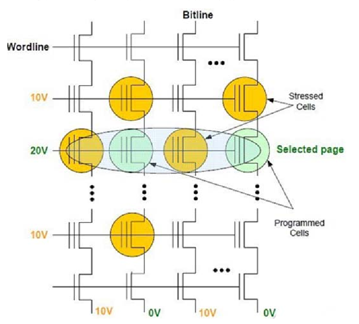
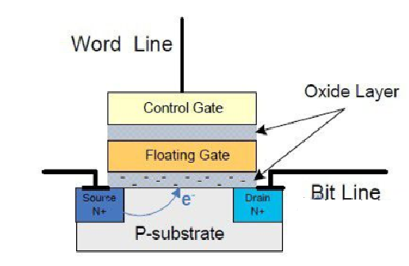
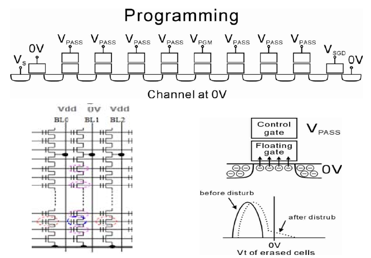
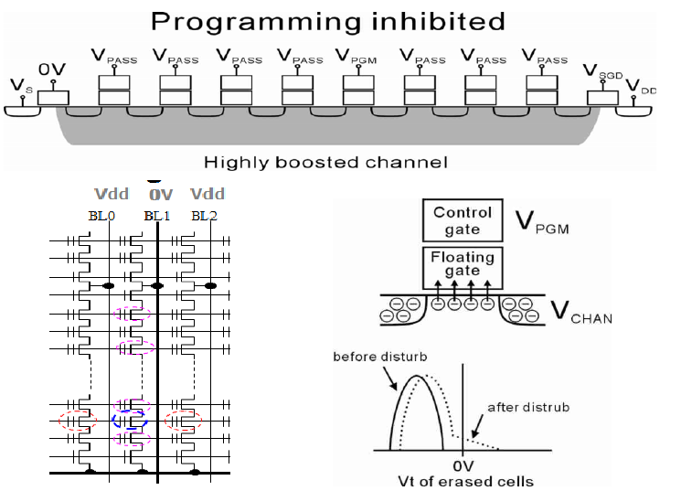
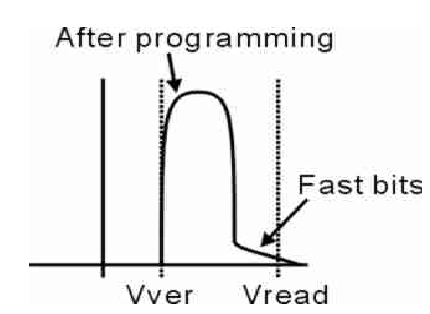
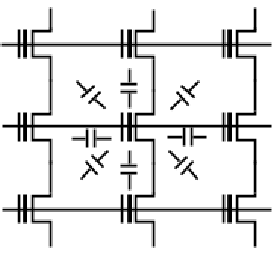

# NAND Flash常见问题

1. **物理损耗**：
    - 闪存单元在重复擦写次数达到一定的阈值之后会产生磨损，这可能导致一些存储单元不再可用（坏块）。
2. **位翻转（Bit Flip)**：
    - NAND Flash存储器在没有任何外部干预的情况下，也可能出现单个bit从1变成0或者从0变成1的情况，称为位翻转错误。
3. **读/写干扰**：
    - 对NAND Flash的某些操作，如频繁读取，可能会影响到相邻单元的稳定性，导致数据的非预期改变。
4. **损耗机制**：
    - NAND Flash的损耗模式可能表现为均匀损耗或者局部损耗，这取决于块的使用频率等因素。
5. **数据保持性**：
    - 存储的数据在没有读写操作的情况下可能会随着时间而退化，导致数据丢失。

## 读/写干扰

NAND读取操作：以页尾单位，一次读取整页，先选择块，再选择位线，读取电压5V打开所有未选择的存储单元，如果存储单元是1，则VT<0，通道没有电流，如 果存储单元是0，则VT>0，通道有电流通过。

写入过程：一次同时写一个页， 先选择块，再选择位线，被选择的位线加电压20V，未选择的位线加电压10V，被编程的字符串接地;其他字符串加10V，相邻的字线被加压10V。

**读取某个页时，邻近的bit位会受到升高电压的干扰，造成位出错，导致写入干扰现象的读取次数门槛介于区块被抹除间**。

假如连续从一个记忆单元读取，此记忆单元将不会受损，而受损却是接下来被读取的周围记忆单元。

MLC NAND闪存由于阈值电压相比SLC NAND闪存更接近，在读/写中很容易对邻近的单元造成干扰。

**解决**：NAND闪存控制器通常会计算从上次抹除动作后的区块读取动作总次数。当计数值超过所设置的目标值门槛时，受影响的区块会被复制到一个新的区块，然后将原区块抹除后释放到区块回收区中。原区块在抹除动作后就会像新的一样。

## 数据保持性

数据保存期限指的是当NAND闪存完全断电后，数据能在NAND闪存里保存多久。NAND存储单元必须保证一个稳定的电压水平，来保证数据无误。典型的SLC NAND闪存一般数据保存期限为10年。

电荷从悬浮门里漏出，存储单元的电压值慢慢地变化，变的和原始值不一样了，我们叫做**电子漂移**，当随着时间的流逝，电荷泄漏到一定程度，改变了NAND存储单元里悬浮门的电压对应的逻辑值，造成位出错。

数据保存期限会随着擦写次数的增加而明显降低，而且从上面的原理中可以看出，MLC NAND闪存的数据保存期限明显会比SLC NAND闪存少。（更容易被干扰） 

## 坏块管理

NAND中有两种坏块类型：

    - 出厂坏块：出厂时NAND就有的坏块。
    - 积累坏块：在多次的写入/擦除循环中，某些NAND存储单元的电荷电压被永久性的改变了，包含这个的NAND单元就不可用了。 

所以固态硬盘需要有坏块管理才能使用，主控制器用坏块表来映射出厂坏块和积累坏块到坏块区内，出厂时，颗粒的第一个块Block0厂商会保证可用（至少ECC后可用）。 

## 擦写次数限制

造成NAND擦写次数限制的因素：

    - 1，电荷被困在氧化层，不能进入悬浮门。 
    - 2，氧化层结构被破坏。

当氧化层损坏到达一定程度时，电荷越来越难在P-substrate和悬浮门之间流动。电荷被困在氧化层造成悬浮门中的电压到不了阈值电压，所以说这个 NAND单元就要被放入坏块区了。 

## NAND Flash写入干扰

### VPASS电压过高引起的写入干扰 

会发生在所选位线上的相邻单元，如果所选位线上的相邻单元数据为1，且VPASS电压过高时，它的存储 信息就会发生改变（从1变成0），造成数据出错。

### VPASS电压过低引起的写入干扰 

发生在所选字线的相邻单元，如果所选字线的相邻单元信息为1，当VPASS电压过低时，P-substrate增压不够，控制栅极电压大于VPASS，它的存储信息就会发生改变（从1变成0），造成数据错误。

### 过量写入引起的写入干扰 

由于一小部分电子会比预期的跑的更快，这些位的电压会比预期的更高，导致阈值电压过高，且大于Vread电压，这种情况下，这些位读出来的信息就都为0，导致数据出错。

### YUPIN耦合效应引起的写入干扰 

**YUPIN效应**：相邻浮栅之间耦合的电荷的影响。

YUPIN效应会引起相邻浮栅的阈值电压过高，导致写入数据出错，下图显示的是字线与字线，位线与位线浮栅耦合效应示意图。 

## NAND Flash写入干扰改善方法

1. **确定VPASS电压值范围改善写入干扰**：
    - 计算被写入块区域的每个页的错误位，通过曲线图来找合理的VPASS电压范围值。 
2. **改善位线与位线之间YUPIN效应引起的写入干扰**：
    - 对奇偶单元同时编程能有效减少位线与位线之间YUPIN效应引起的写入干扰。 
3. **改善字线与字线之间YUPIN效应引起的写入干扰**：
    - 改变字线写入的方法，按字线顺序从第0页到第255页逐一写入，能有效减少YUPIN效应。

